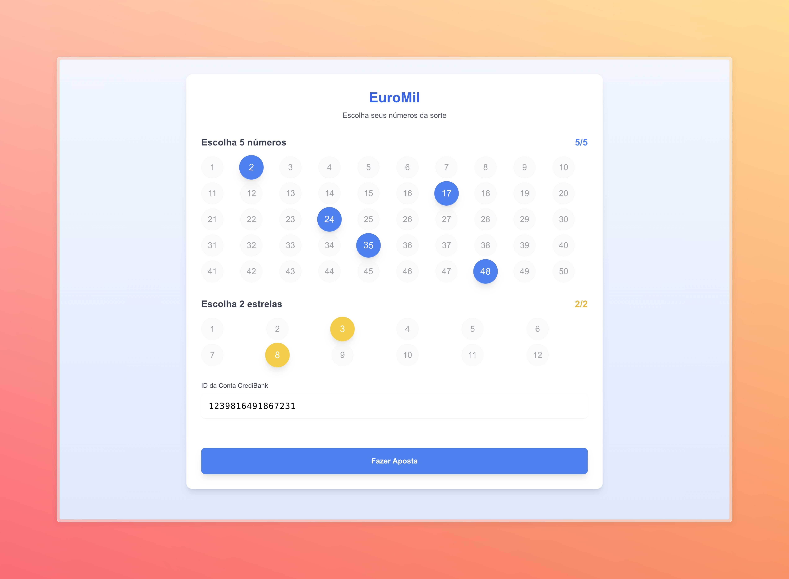

# EuroMil - Sistema de Apostas 🎰


## 📋 Sobre o Projeto
Este é um sistema integrado que permite realizar apostas no EuroMil. O projeto utiliza uma arquitetura distribuída, integrando três componentes principais:

1. **Frontend (Next.js)**: Interface para seleção de números
2. **CrediBank**: Serviço de pagamento para gerar cheques digitais
3. **EuroMilRegister**: Serviço de registro de apostas via gRPC

## ✨ Funcionalidades

### Seleção de Números

- Escolha de 5 números principais (1-50)
- Seleção de 2 números estrela (1-12)
- Interface interativa com feedback visual

### Processamento da Aposta
- Validação do ID da conta (16 dígitos)
- Integração com CrediBank para pagamento
- Registro da aposta via gRPC

### Recibo Digital

- Número da conta
- ID do cheque digital
- Números selecionados
- Data e hora da transação

### Logs
Logs detalhados de todas as operações:
- CrediBank API


- EuroMilRegister gRPC


## 🔧 Tecnologias Utilizadas

### Frontend
- Next.js 13+
- TypeScript
- Tailwind CSS

### Backend Services
#### CrediBank API
[Repositório GitHub](https://github.com/luispeixotoUA/integracao-sistemas/tree/main/CrediBank)
- Spring Boot
- Java 17
- REST API

#### EuroMilRegister
[Repositório GitHub](https://github.com/luispeixotoUA/integracao-sistemas/tree/main/EuroMilRegister)
- Python
- gRPC
- Protocol Buffers

## 🌐 Arquitetura do Sistema
```
                       ┌─────────────┐
                       │   Frontend  │
                       │   Next.js   │
                       └──────┬──────┘
                              │
                     ┌────────┴────────┐
                     │                 │
              ┌──────┴─────┐    ┌──────┴─────┐
              │ CrediBank  │    │   EuroMil  │
              │    REST    │    │    gRPC    │
              └────────────┘    └────────────┘

```

## 🚀 Como Executar

### Pré-requisitos
- Node.js 18+
- Java 17
- Python 3.8+

### Frontend
```
npm install
npm run dev
```

### CrediBank
```
mvn spring-boot:run
```

### EuroMilRegister
```
python -m venv venv
source venv/bin/activate  # Linux/Mac
venv\Scripts\activate     # Windows
pip install -r requirements.txt
python server.py
```

## 📱 Para executar o Projeto

1. Iniciar o serviço CrediBank
2. Iniciar o servidor EuroMilRegister
3. Iniciar o frontend Next.js
4. Aceder a `http://localhost:3000`

## 🔒 Segurança e Validações
- Validação de entrada de números
- Verificação do ID da conta
- Confirmação de transações
- Logs detalhados de todas as operações

## 🌟 Funcionalidades Destacadas

- Interface intuitiva e responsiva
- Feedback visual em tempo real
- Seleção interativa de números
- Modal de confirmação com detalhes da aposta
- Integração eficaz entre serviços

## 👥 Autor
- **Luís Peixoto** - *2402741*

---
*Projeto desenvolvido para a disciplina de Integração de Sistemas - 2024/2025*